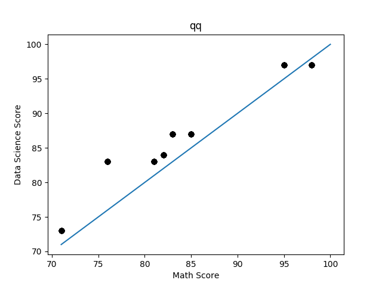
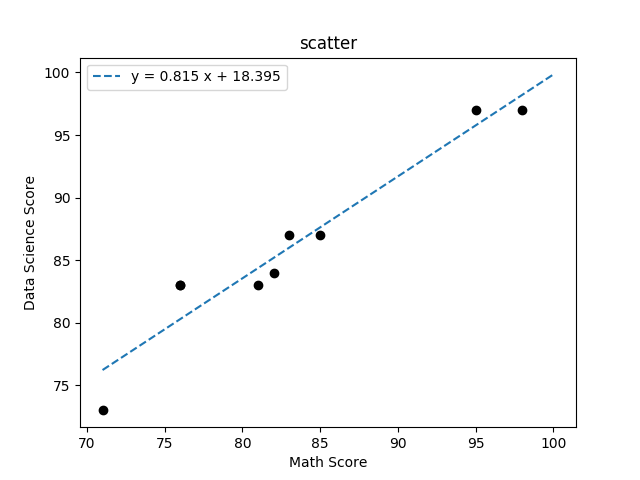

Will Badart (netid: **wbadart**)

Data Science, Homework 01

## 1 Data Description

#### Question 1

mean = total / count = 774 / 9 = **86.0**

median = middle of sorted list (mean of middle 2 for even length) = **84**

mode = most frequent item = **83** (3 occurrences)

#### Question 2

variance = avg squared difference from mean = **49 1/3**

std = sqrt(variance) ~= **7.02377**

#### Question 3

Let `x'` denote the new value.

    u'(u, n, x') = (u * n + x') / (n + 1)
    u'(86, 9, 100) = (86 * 9 + 100) / (9 + 1) = 87.4

`u * n` gives the sum of all previous `x`, to which we add the new value, `x'`,
which is the dividend for the new length, `n + 1`. See `incmean` in
`wbadart-HW1-Q1.py`.

Let `x'` denote the new value and `u'` denote the expression for the
incremental mean described above.

    `v'(v, u, n, x') = (n * v + (u' - x') ** 2) / (n + 1)`
    `v'(49 1/3, 86, 9, 100) = (9 * (49 1/3) + (87.4 - 100)**2) / (9 + 1) ~= 62.276`

Multiplying the length by the known variance gives the previous sum of square
differences, to which we add the square difference to the mean of the new value.
Dividing by the new length gives the new variance. See `incvariance` in
`wbadart-HW1-Q1.py`.

## 2 Data Visualization

#### Question 1

In general, the percentiles site *above* the line `y = x`, i.e., the data
science side tends to score higher. This suggests that **data science** is the
easier class.

The plot suggests that the bottom student has a disproportionately low data
science score given their math score, i.e. is an outlier.
